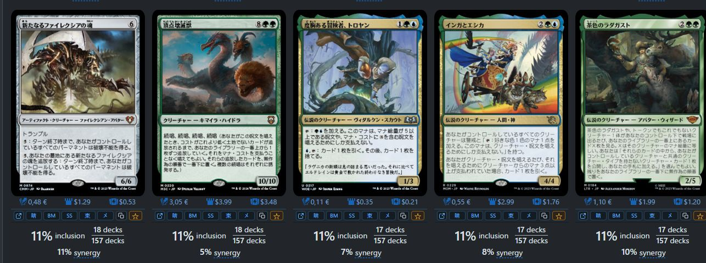

# EDHRECを日本語カード画像で見やすくするTampermonkeyスクリプト

EDHRECは、統率者デッキを組むときにとても便利なサイトです。

採用されているカードや相性のよいカードをまとめて見られるので、デッキの候補探しに便利です。

ただ、カード名や画像は英語が中心です。日本語名でデッキリストや買い物リストを作っていると、「このカード、日本語名なんだっけ？」と何度も確認することになります。

このスクリプトは、その手間を減らすためのものです。EDHREC上のカード画像を、見つかる範囲で日本語版に差し替えます。

## 何ができるか

日本語版の画像があるカードは、EDHREC上でそのまま日本語画像で確認できます。

カード画像の下には、小さな操作バーが出ます。そこから日本語名をコピーしたり、晴れる屋、BIG MAGIC、シングルスター、東京MTG、メルカリで検索したりできます。

気になったカードは `★` でお気に入りに入れられます。あとで `全部コピー` を押すと、カード名をまとめてコピーできます。

ExcelやGoogleスプレッドシートに貼ると、カード名が1行ずつ縦に並びます。買い物リストや調整メモを作るときに楽です。

## インストール

1. Tampermonkeyを入れる: https://www.tampermonkey.net/
2. Greasy Forkのスクリプトページを開く: https://greasyfork.org/ja/scripts/580860-edhrec-japanese-card-image-replacer
3. `Install this script` を押す
4. Tampermonkeyの確認画面で `インストール` を押す
5. EDHRECを開く: https://edhrec.com/

## 使い方

Tampermonkeyでスクリプトを有効にした状態で、EDHRECの統率者ページやカードページを開きます。

カード画像が順番に日本語版へ差し替わります。差し替えが終わったカードには、画像の下に操作バーが表示されます。

- コピー: 日本語名をコピー
- ★: お気に入りに追加
- 晴 / BM / SS / 東 / メ: 各ショップやメルカリで検索

右下の `★ お気に入り` から、お気に入り一覧を開けます。

## 英語画像のまま残るカード

日本語版の画像が見つからないカードは、英語画像のまま表示されることがあります。

その場合でも、コピーや検索ボタンはできるだけ使えるようにしています。

## おまけ

Scryfall TaggerやScryfallの検索結果ページでも、同じように日本語画像表示、コピー、ショップ検索が使えます。

EDHRECで見つけたカードを、Scryfall側でも続けて確認したいときに便利です。

## うまく動かないとき

- Tampermonkeyでスクリプトが有効か確認する
- Greasy Forkの最新版を使う
- EDHRECを再読み込みする
- 広告ブロッカーなどで止まっていないか確認する

## まとめ

EDHRECは便利ですが、日本語名でカードを管理していると、英語名を調べ直す手間が出ます。

このスクリプトを入れると、EDHRECを見ながら日本語画像を確認し、カード名のコピーや検索までその場でできます。

日本語で統率者デッキを組みたい人向けの、小さな補助ツールです。

## リンク

- EDHREC: https://edhrec.com/
- Greasy Fork: https://greasyfork.org/ja/scripts/580860-edhrec-japanese-card-image-replacer
- Tampermonkey: https://www.tampermonkey.net/
- GitHub: https://github.com/soichirow/edhrec-ja-images
